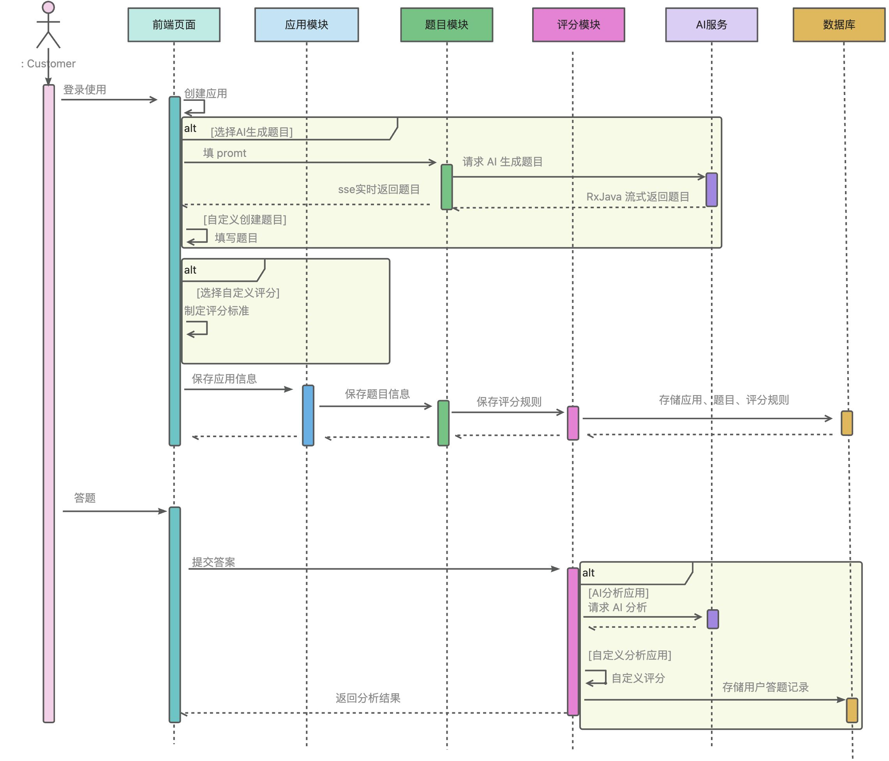

### 项目介绍
基于 Spring Boot + Redis + ChatGLM + RxJava + SSE +MyBatis-Plus 等技术实现的 AI 智能答题应用平台。
用户可以基于 AI 快速制作并发布答题应用，支持检索、分享、在线答题并基于 AI 得到回答总结；管理员可以集中管理和审核应用。

项目网页前端地址：https://github.com/hexinKing/hxdada-frontend.git
项目小程序前端地址：https://github.com/hexinKing/mbti-test-mini

### 项目功能

## 用户模块
- 注册
- 登录
- 管理用户 - 增删改查（仅管理员可用）

## 应用模块
- 创建应用
- 修改应用
- 删除应用
- 查看应用列表
- 查看应用详情
- 查看自己创建的应用
- 管理应用 - 增删改查（仅管理员可用）
- 审核发布和下架应用（仅管理员可用）
- 应用分享（扫码查看）

## 题目模块
- 创建题目（包括题目选项得分设置）
- 修改题目
- 删除题目
- 管理题目 - 增删改查（仅管理员可用）
- AI 生成题目

## 评分模块
- 创建评分结果
- 修改评分结果
- 删除评分结果
- 根据回答计算评分结果（多种评分策略）
- 自定义规则评分 - 测评类
- 自定义规则评分 - 打分类
- AI 评分
- 管理评分结果 - 增删改查（仅管理员可用）

## 回答模块
- 提交回答（创建）
- 查看某次回答的评分结果
- 查看自己提交的回答列表
- 管理回答 - 增删改查（仅管理员可用）

## 统计分析模块
- 应用评分结果分析和查看

### 项目核心亮点 ⭐
- 库表设计：根据业务设计用户 / 应用 / 题目 / 评分结果 / 用户答题表。其中题目表采用 JSON 存储复杂的嵌套题目和选项，便于维护扩展，并通过给题目表添加 appId 索引提升检索性能。
- 评分模块：基于 策略模式 实现了多种用户回答评分算法（如统计得分、AI 评分等），全局执行器会扫描策略类上的 自定义注解 并选取策略，相较于 if else 提高了系统的可扩展性。
- 基于 ChatGLM AI 封装了通用 AI 服务，并通过配置类自动读取 key 配置初始化 AI 客户端 Bean，便于全局使用
- AI 生成题目：通过系统预设、少样本学习、任务拆解等手段优化 Prompt，让 AI 返回 JSON 题目内容，便于后端处理。

### 技术选型

## 后端
- Java Spring Boot 开发框架（万用后端模板）
- 存储层：MySQL 数据库 + Redis 缓存 + 腾讯云 COS 对象存储
- MyBatis-Plus 及 MyBatis X 自动生成
- Redisson 分布式锁
- Caffeine 本地缓存
- ⭐️ 基于 ChatGLM 大模型的通用 AI 能力
- ⭐️ RxJava 响应式框架 + 线程池隔离实战
- ⭐️ SSE 服务端推送
- ⭐️ Shardingsphere 分库分表
- ⭐️ 幂等设计 + 分布式 ID 雪花算法
- ⭐️ 多种设计模式
- ⭐️ 多角度项目优化：性能、稳定性、成本优化、产品优化等

### 架构设计

## 1、核心业务流程图

## 2、时序图

## 3、架构设计图
